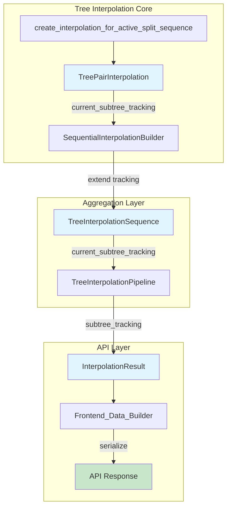

# Design Document: Subtree Tracking Integration

## Overview

This design extends the existing `current_pivot_edge_tracking` pattern to propagate `current_subtree_tracking` through the interpolation pipeline to the frontend API. The implementation follows the established tracking pattern, adding a parallel subtree tracking list that maintains 1:1 correspondence with pivot_edge tracking and interpolated trees.

The changes are minimal and surgical:
1. Extend `TreeInterpolationSequence` dataclass with `current_subtree_tracking` field
2. Update `SequentialInterpolationBuilder` to aggregate subtree tracking from each pair
3. Extend `InterpolationResult` TypedDict to include subtree tracking
4. Update `Frontend_Data_Builder` to serialize and expose subtree tracking in API response

## Architecture



## Components and Interfaces

### 1. TreeInterpolationSequence Extension

**File:** `brancharchitect/tree_interpolation/types/tree_interpolation_sequence.py`

```python
@dataclass
class TreeInterpolationSequence:
    # Existing fields...
    interpolated_trees: list[Node]
    current_pivot_edge_tracking: list[Optional[Partition]]
    # ... other existing fields ...

    # NEW FIELD
    current_subtree_tracking: list[Optional[Partition]] = field(
        default_factory=_empty_partition_list
    )
```

**Interface Contract:**
- `len(current_subtree_tracking) == len(current_pivot_edge_tracking) == len(interpolated_trees)`
- For original trees: `current_subtree_tracking[i] is None`
- For interpolated trees: `current_subtree_tracking[i]` is the Partition being moved

### 2. SequentialInterpolationBuilder Updates

**File:** `brancharchitect/tree_interpolation/sequential_interpolation.py`

```python
class SequentialInterpolationBuilder:
    def _initialize_build_state(self) -> None:
        # Existing initializations...
        self.current_pivot_edge_tracking: List[Optional[Partition]] = []
        # NEW
        self.current_subtree_tracking: List[Optional[Partition]] = []

    def _process_pair(self, t1: Node, t2: Node, pair_index: int, ...) -> Node:
        # Existing code...
        self.current_pivot_edge_tracking.extend(
            interpolation_result.current_pivot_edge_tracking
        )
        # NEW
        self.current_subtree_tracking.extend(
            interpolation_result.current_subtree_tracking
        )

    def _add_delimiter_frame(self, tree: Node) -> None:
        self.interpolated_trees.append(tree.deep_copy())
        self.current_pivot_edge_tracking.append(None)
        # NEW
        self.current_subtree_tracking.append(None)

    def _finalize_sequence(self, original_tree_count: int) -> TreeInterpolationSequence:
        return TreeInterpolationSequence(
            # Existing fields...
            current_pivot_edge_tracking=self.current_pivot_edge_tracking,
            # NEW
            current_subtree_tracking=self.current_subtree_tracking,
        )
```

### 3. InterpolationResult Extension

**File:** `brancharchitect/movie_pipeline/types/interpolation_sequence.py`

```python
class InterpolationResult(TypedDict):
    # Existing fields...
    interpolated_trees: List[Node]
    tree_metadata: List[TreeMetadata]
    # ... other existing fields ...

    # NEW FIELD
    subtree_tracking: List[Optional[List[int]]]  # Serialized partition indices
```

### 4. TreeInterpolationPipeline Updates

**File:** `brancharchitect/movie_pipeline/tree_interpolation_pipeline.py`

```python
def process_trees(self, trees: Node | List[Node]) -> InterpolationResult:
    # Existing processing...
    seq_result = self._interpolate_tree_sequence(...)

    return InterpolationResult(
        # Existing fields...
        subtree_tracking=self._serialize_subtree_tracking(
            seq_result.current_subtree_tracking
        ),
    )

def _serialize_subtree_tracking(
    self,
    tracking: List[Optional[Partition]]
) -> List[Optional[List[int]]]:
    """Serialize partition tracking to index arrays."""
    return [
        sorted(list(p.indices)) if p is not None else None
        for p in tracking
    ]
```

### 5. Frontend Data Builder Updates

**File:** `webapp/services/frontend_data_builder.py`

```python
def assemble_frontend_dict(movie_data: MovieData) -> Dict[str, Any]:
    return {
        # Existing fields...
        "split_change_tracking": movie_data.split_change_tracking,
        # NEW
        "subtree_tracking": movie_data.subtree_tracking,
    }
```

## Data Models

### Subtree Tracking Data Flow

```
TreePairInterpolation.current_subtree_tracking: List[Optional[Partition]]
    ↓ (extend in SequentialInterpolationBuilder)
TreeInterpolationSequence.current_subtree_tracking: List[Optional[Partition]]
    ↓ (serialize in TreeInterpolationPipeline)
InterpolationResult["subtree_tracking"]: List[Optional[List[int]]]
    ↓ (pass through Frontend_Data_Builder)
API Response["subtree_tracking"]: List[Optional[List[int]]]
```

### Example API Response Structure

```json
{
  "interpolated_trees": [...],
  "tree_metadata": [...],
  "split_change_tracking": [[0, 1, 2], null, [3, 4], ...],
  "subtree_tracking": [[5, 6], null, [7, 8, 9], ...],
  ...
}
```

Where:
- Index `i` in `subtree_tracking` corresponds to `interpolated_trees[i]`
- `null` indicates an original tree (no subtree being moved)
- `[5, 6]` indicates taxa indices 5 and 6 are the subtree being moved


## Correctness Properties

*A property is a characteristic or behavior that should hold true across all valid executions of a system—essentially, a formal statement about what the system should do. Properties serve as the bridge between human-readable specifications and machine-verifiable correctness guarantees.*

### Property 1: Length Invariant

*For any* TreeInterpolationSequence, the length of `current_subtree_tracking` SHALL equal the length of `current_pivot_edge_tracking` AND the length of `interpolated_trees`.

**Validates: Requirements 1.3, 3.1, 3.4**

### Property 2: Pairing Invariant

*For any* TreeInterpolationSequence and any index `i`, `current_pivot_edge_tracking[i] is None` if and only if `current_subtree_tracking[i] is None`.

**Validates: Requirements 1.4, 3.2, 3.3**

### Property 3: Serialization Determinism

*For any* Partition object, serializing it to index array format SHALL produce a sorted list of integer indices, and serializing the same Partition multiple times SHALL produce identical results.

**Validates: Requirements 2.2**

### Property 4: Aggregation Correctness

*For any* sequence of N tree pairs processed by SequentialInterpolationBuilder, the final `current_subtree_tracking` list SHALL contain exactly the concatenation of all individual pair subtree tracking lists plus N+1 None entries for delimiter frames.

**Validates: Requirements 1.1, 4.2**

## Error Handling

### Error Scenarios

| Scenario | Detection | Response |
|----------|-----------|----------|
| TreePairInterpolation missing subtree tracking | Check for empty list | Log warning, use empty list |
| Length mismatch after aggregation | Assert in _finalize_sequence | Raise ValueError with diagnostic info |
| Serialization of invalid Partition | Check for None/empty indices | Return None for that entry |

### Error Codes

No new error codes required. Existing pipeline error handling applies.

### Logging

```python
# In SequentialInterpolationBuilder._process_pair
self.logger.debug(
    f"Pair {pair_index}: aggregated {len(interpolation_result.current_subtree_tracking)} subtree tracking entries"
)

# In _finalize_sequence validation
if len(self.current_subtree_tracking) != len(self.interpolated_trees):
    self.logger.error(
        f"Tracking length mismatch: subtree={len(self.current_subtree_tracking)}, "
        f"trees={len(self.interpolated_trees)}"
    )
```

## Testing Strategy

### Dual Testing Approach

This feature requires both unit tests and property-based tests:

- **Unit tests**: Verify specific examples, edge cases, and integration points
- **Property tests**: Verify universal properties across all valid inputs

### Property-Based Testing Configuration

- **Library**: `hypothesis` (Python)
- **Minimum iterations**: 100 per property test
- **Tag format**: `Feature: microsteps-api-integration, Property {number}: {property_text}`

### Test Plan

#### Unit Tests

1. **TreeInterpolationSequence field existence**
   - Verify `current_subtree_tracking` field exists and is initialized to empty list
   - _Requirements: 1.2, 4.1_

2. **API response structure**
   - Verify `subtree_tracking` field exists in assembled response
   - Verify format matches `split_change_tracking`
   - _Requirements: 2.1, 2.3, 4.3_

3. **Delimiter frame handling**
   - Verify `_add_delimiter_frame` appends None to subtree tracking
   - _Requirements: 1.4_

#### Property Tests

1. **Property 1: Length Invariant**
   - Generate random tree sequences
   - Process through SequentialInterpolationBuilder
   - Assert all three lists have equal length
   - _Requirements: 1.3, 3.1, 3.4_

2. **Property 2: Pairing Invariant**
   - Generate random tree sequences
   - Process through pipeline
   - For each index, assert pivot_edge None ↔ subtree None
   - _Requirements: 1.4, 3.2, 3.3_

3. **Property 3: Serialization Determinism**
   - Generate random Partition objects
   - Serialize multiple times
   - Assert results are identical and sorted
   - _Requirements: 2.2_

4. **Property 4: Aggregation Correctness**
   - Generate random tree pair sequences
   - Track expected subtree entries per pair
   - Assert final list matches expected concatenation
   - _Requirements: 1.1, 4.2_

### Test File Locations

```
test/tree_interpolation/test_subtree_tracking.py          # Unit tests
test/tree_interpolation/test_subtree_tracking_props.py    # Property tests
```
